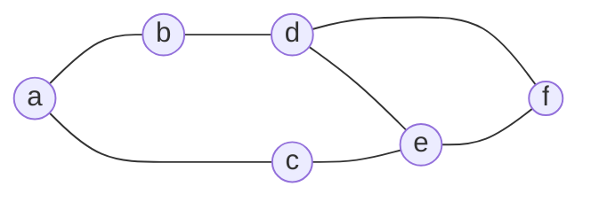

> # Graph
```js
// vertices: [1, 2, 3], edges without weight: [[1, 2], [2, 3], [3, 1]]
// adjList: {
//  1: [{ node: 2, weight: 21 }],
//  2: [{ node: 3, weight: 45 }],
//  3: [{ node: 1, weight: 32 }]
// }

// vertices: [1, 2, 3], edges with weight: [[1, 2, 21], [2, 3, 45], [3, 1, 32]]
// adjList: {
//  1: [{ node: 2, weight: 21 }],
//  2: [{ node: 3, weight: 45 }],
//  3: [{ node: 1, weight: 32 }]
// }

// Undirected Graph
// adjList: {
//  1: [{ node: 2, weight: 21 }, { node: 3, weight: 32 }],
//  2: [{ node: 1, weight: 21 }, { node: 3, weight: 45 }],
//  3: [{ node: 2, weight: 45 }, { node: 1, weight: 32 }]
// }

class Graph {
    constructor(vertices = [], edges = [], isDirected = false) {
        this.adjList = new Map();
        this.isDirected = isDirected;
        this.initializeGraph(vertices, edges);
    }

    initializeGraph(vertices, edges) {
        vertices.forEach(vertex => this.addVertex(vertex));
        edges.forEach(edge => {
            const [source, destination, weight = 0] = edge;
            this.addEdge(source, destination, weight);
        });
    }

    displayMermaidGraph(edges) {
        let mermaidGraph = "```mermaid\ngraph LR\n";

       // Determine the edge connector based on graph type
       const edgeConnector = this.isDirected ? '-->' : '---';

        // Process each edge to conform to Mermaid's syntax
        for (const [source,destination,weight] of edges) {
            if (weight !== undefined) {
                // If the edge has a weight, include it in the label
                mermaidGraph += `    ${source} ${edgeConnector}|${weight}| ${destination}\n`;
            } else {
                // Otherwise, just display the edge
                mermaidGraph += `    ${source} ${edgeConnector} ${destination}\n`;
            }
        }

        // Close the mermaid graph definition
        mermaidGraph += "```\n";

        return mermaidGraph;
    }

    displayMermaidGraph2(){
        return this.displayMermaidGraph(this.getAllEdges());
    }

    addVertex(vertex) {
        if (!this.adjList.has(vertex)) {
            this.adjList.set(vertex, []);
        }
    }

    addEdge(source, destination, weight = 0) {
        if (!this.adjList.has(source)) {
            this.addVertex(source);
        }
        if (!this.adjList.has(destination)) {
            this.addVertex(destination);
        }
        this.adjList.get(source).push({ node: destination, weight });

        if (!this.isDirected) {
            this.adjList.get(destination).push({ node: source, weight });
        }
    }

    getVertices() {
      return Array.from(this.adjList.keys());
    }

    getAllEdges() {
      const edges = [];
      const addedEdges = new Set(); // Set to track added edges
    
      this.adjList.forEach((nodeList, source) => {
        nodeList.forEach(({ node, weight }) => {
          // Create a unique identifier for the edge
          let edgeId;
          if (this.isDirected) {
            // Directed graph: consider edge direction
            edgeId = `${source}-${node}`;
          } else {
            // Undirected graph: order doesn't matter
            const sortedVertices = [source, node].sort();
            edgeId = `${sortedVertices[0]}-${sortedVertices[1]}`;
          }
    
          // Check if this edge has already been added
          if (!addedEdges.has(edgeId)) {
            edges.push([source, node, weight]);
            addedEdges.add(edgeId);
          }
        });
      });
    
      return edges;
    }


    deleteVertex(vertex) {
        if (!this.adjList.has(vertex)) {
            return;
        }

        if (!this.isDirected) {
            // For undirected graphs, remove the edges from neighboring vertices
            this.adjList.get(vertex).forEach(({ node }) => {
                this.adjList.set(node, this.adjList.get(node).filter(edge => edge.node !== vertex));
            });
        } else {
            // For directed graphs, remove the incoming edges from all vertices
            this.adjList.forEach((edges, vtx) => {
                this.adjList.set(vtx, edges.filter(edge => edge.node !== vertex));
            });
        }

        //directed_graph: all outgoing edges would be deleted when this vertex entry is deleted from adjList Map
        //undirected_graph: all edges would be deleted (from neighboring vertices and from this vertex to neighboring vertices)
        // which are part of this vertex entry in adjList
        this.adjList.delete(vertex);
    }


   deleteEdge(source, destination) {
        if (!this.adjList.has(source)) {
            return;
        }

        // Remove the edge from the source vertex
        this.adjList.set(source, this.adjList.get(source).filter(edge => edge.node !== destination));

        // For undirected graphs, also remove the reverse edge
        if (!this.isDirected) {
            if(this.adjList.has(destination)){
              this.adjList.set(destination, this.adjList.get(destination).filter(edge => edge.node !== source));
            }
        }
    }

    findEdge(source, destination) {
        if (!this.adjList.has(source)) {
            return null;
        }

        return this.adjList.get(source).find(edge => edge.node === destination);
    }

    getNeighbors(vertex) {
        if (!this.adjList.has(vertex)) {
            return [];
        }

        return this.adjList.get(vertex).map(edge => edge.node);
    }

    getNeighborsWithWeight(vertex) {
        if (!this.adjList.has(vertex)) {
            return [];
        }

        return this.adjList.get(vertex).map(({ node, weight }) => ({ node, weight }));
    }

    getWeight() {
        let totalWeight = 0;
        for (let edges of this.adjList.values()) {
            for (let { weight } of edges) {
                totalWeight += weight;
            }
        }
        // undirected graphs, half the weight
        if (!this.isDirected) {
            return totalWeight / 2;
        }

        return totalWeight;
    }
}


```

> # Graph Algorithms
```js
let vertices = ['a', 'b', 'c', 'd', 'e', 'f']
let edges = [
  ['a', 'b'],
  ['a', 'c'],
  ['b', 'd'],
  ['c', 'e'],
  ['d', 'f'],
  ['d', 'e'],
  ['e', 'f'],
]
```


> ## DFS
DFS (Depth-First Search) in a graph is like exploring a network of connected points. Starting from one point, you keep moving to a connected point that you haven't visited yet, going deeper into the network. When you can't go any further, you backtrack to the last point where you had other options and explore a different path. You continue this process until you've checked out every point in the network.


> ## DFSRecursive
```js
function DFSRecursive(start, graph) {
  let result = []
  let visited = new Set();

  ;(function dfs(v) {
    visited.add(v);
    result.push(v)

    let neighbours = graph.getNeighbors(v)
    neighbours.forEach((n) => {
      if (!visited.has(n)) {
        dfs(n)
      }
    })
  })(start)

  return result
}

let vertices = ['a', 'b', 'c', 'd', 'e', 'f']
let edges = [
  ['a', 'b'],
  ['a', 'c'],
  ['b', 'd'],
  ['c', 'e'],
  ['d', 'f'],
  ['d', 'e'],
  ['e', 'f'],
]

let graph = new Graph(vertices, edges)
console.log('DFSRecursive', DFSRecursive('a', graph))
```

> ## DFSIterative

```js
function DFSIterative(start, graph) {
  let result = []
  let visited = new Set([start]);
  let stack = [start]

  while (stack.length) {
    let v = stack.pop()
    result.push(v)

    let neighbours = graph.getNeighbors(v)
    neighbours.forEach((n) => {
      if (!visited.has(n)) {
        visited.add(n);
        stack.push(n)
      }
    })
  }

  return result
}

let vertices = ['a', 'b', 'c', 'd', 'e', 'f']
let edges = [
  ['a', 'b'],
  ['a', 'c'],
  ['b', 'd'],
  ['c', 'e'],
  ['d', 'f'],
  ['d', 'e'],
  ['e', 'f'],
]

let graph = new Graph(vertices, edges)
console.log('DFSIterative', DFSIterative('a', graph))
```

> ## BFSIterative
Starting from the root, all the nodes at a particular level are visited first and then the nodes of the next level are traversed till all the nodes are visited.
Links: https://www.hackerearth.com/practice/algorithms/graphs/breadth-first-search/visualize/

BFS is a traversing algorithm where you should start traversing from a selected node (source or starting node) and traverse the graph **layerwise** thus exploring the neighbour nodes (nodes which are directly connected to source node). You must then move towards the next-level neighbour nodes.
```js
function BFSIterative(start, graph) {
  let result = []
  let visited = new Set([start]);
  let queue = [start]

  while (queue.length) {
    let v = queue.shift()
    result.push(v)

    let neighbours = graph.getNeighbors(v)
    neighbours.forEach((n) => {
      if (!visited.has(n)) {
        visited.add(n);
        queue.push(n)
      }
    })
  }

  return result
}

let vertices = ['a', 'b', 'c', 'd', 'e', 'f']
let edges = [
  ['a', 'b'],
  ['a', 'c'],
  ['b', 'd'],
  ['c', 'e'],
  ['d', 'f'],
  ['d', 'e'],
  ['e', 'f'],
]

let graph = new Graph(vertices, edges)
console.log('BFSIterative', BFSIterative('a', graph))
```

> # Shortest Path Dijkstra Algorithm
Dijkstra's algorithm is a way to find the shortest path from one point (or "vertex") to all other points in a network of points connected by lines (or "edges")

Dijkstra’s algorithm finds a shortest path tree from a single source node, by building a set of nodes that have minimum distance from the source. **Single Source Shortest Path**.
Find shortest path from some starting vertex to all the other vertices.
Use minimum priority queue to select next minimum vertex
If we find the new minimum then perform relaxation procedure.

> Dijkstra algorithm may or may not work in case of **negative edges**.

Links: https://www.youtube.com/watch?v=bZkzH5x0SKU


```js

function dijkstra(graph, startVertex) {
  const distances = new Map();
  const predecessors = new Map();
  const result = new Set(); // Track the order of processed vertices
  const priorityQueue = new PriorityQueue();
  const vertices = [...graph.adjList.keys()];

  // Initialize distances and predecessors
  vertices.forEach((vertex) => {
    distances.set(vertex, Infinity);
    predecessors.set(vertex, null);
  });
  distances.set(startVertex, 0);

  // Enqueue start vertex
  priorityQueue.enqueue(startVertex, 0);

  while (!priorityQueue.isEmpty()) {
    const { value: currentVertex, priority: currentDistance } = priorityQueue.dequeue();

    // Skip this node if a shorter path was already processed
    if (result.has(currentVertex)) continue;
    result.add(currentVertex);

    
    graph
      .getNeighborsWithWeight(currentVertex)
      .filter(({ node: neighbor }) => !result.has(neighbor)) // Filter out neighbors that are already in result
      .forEach(({ node: neighbor, weight }) => {
        // Iterate over all unprocessed neighbors of the current vertex

        // Calculate new distance to the neighbor
        const newDistance = currentDistance + weight;

        // Update if new distance is shorter, relax each edge (u,v) adjacent to u
        if (newDistance < distances.get(neighbor)) {
          distances.set(neighbor, newDistance);
          predecessors.set(neighbor, currentVertex);
          priorityQueue.enqueue(neighbor, newDistance);
        }
      });
  }

  return { distances, predecessors, result };
}

// Example usage
let vertices = ["a", "b", "c", "d", "e", "f"];
let edges = [
  ['a', 'b', 2],
  ['a', 'd', 8],
  ['b', 'd', 5],
  ['b', 'e', 6],
  ['d', 'e', 3],
  ['d', 'f', 2],
  ['e', 'f', 1],
  ['e', 'c', 9],
  ['f', 'c', 3],
]
const graph = new Graph(vertices, edges);
let res = dijkstra(graph, "a")
console.log(res)

```
> # Minimum Spanning Tree (MST)

A **Minimum Spanning Tree (MST)** is a concept from graph theory, which is used in the context of a connected, undirected graph. It refers to a subset of the edges of the graph that connects all the vertices together, without any cycles, and with the minimum possible total edge weight.

### Why is it a Tree?

1. **Connects All Vertices**: Like a tree in nature, which has branches extending out from a single trunk, a spanning tree in a graph connects all the vertices together. In a graph, vertices are like the nodes, and edges are like the branches.

2. **No Cycles**: A tree doesn't loop back on itself; it only branches out. Similarly, a spanning tree in a graph contains no cycles. This means you can't start at one vertex, travel along the edges of the tree, and return to the same vertex without retracing your steps.

3. **Minimum Number of Edges**: A tree has the fewest branches necessary to keep it connected. In a graph, a spanning tree has the fewest edges needed to connect all the vertices. For a graph with `V` vertices, any spanning tree will have exactly `V-1` edges.

### Why "Minimum" Spanning Tree?

- The "minimum" in Minimum Spanning Tree refers to the total weight of the edges in the tree being as small as possible. In a graph where edges have weights (or costs), the MST is the spanning tree with the lowest total cost.

### Applications of MST

The concept of a Minimum Spanning Tree has practical applications in various fields. Some examples include:

1. **Network Design**: Designing the least expensive network, like laying out electricity cables or water pipelines, where you want to connect a set of points (like cities or houses) with the least total distance (or cost).


### Algorithms for Finding MST

Several algorithms can be used to find the Minimum Spanning Tree of a graph, with Kruskal's and Prim's algorithms being the most famous. Both are efficient in different scenarios and are based on greedy strategies, where the algorithm makes the best choice (like picking the smallest edge) at each step.

In summary, a Minimum Spanning Tree is a subset of a graph that forms a tree connecting all vertices with the least total edge weight and no cycles. It is a fundamental concept with various practical applications in computer science and other fields.

Links: https://www.youtube.com/watch?v=4ZlRH0eK-qQ

> # Disjoint Set

```js
/**
 * Find
 * Union
 * Collapsing Find
 * Ranking
 */
// There are 2 ways you can represent disjoint sets
// 1. through arrays
// [-1, -1, -1, -1, -1, -1] // represent the parents, negative means its root
//   0,  1,  2,  3,  4,  5 // indices represent the vertices

// 2. through trees

class DisjointSetItem {
  constructor(value) {
    this.value = value
    this.parent = -1
  }

  getKey() {
    return this.value
  }

  // recursive implementation
  // getRoot() {
  //  return this.isRoot() ? this : this.parent.getRoot()
  // }

  getRoot() {
    let current = this;
    while (!current.isRoot()) {
      current = current.parent;
    }
    return current;
  }

  isRoot() {
    return this.parent < 0
  }

  // Fastest way of getting rank
  getRank() {
    return Math.abs(this.getRoot().parent)
  }

  addChild(childItem) {
    // Find the roots of the current item and the child item
   let thisRoot = this.getRoot();
   let childRoot = childItem.getRoot();
    
   // If they are in the same set, do nothing
   if (thisRoot === childRoot) {
     return this;
   }
    
   // Get the absolute ranks (sizes) of the root items
   const thisRank = Math.abs(thisRoot.parent);
   const childRank = Math.abs(childRoot.parent);
    
   // Union by rank
   if (childRank > thisRank) {
   // If this set is smaller, attach it to the child's root
     thisRoot.parent = childRoot;
     childRoot.parent -= thisRank; // Decrement child's root's parent by this set's rank
   } else {
     // If child set is smaller, attach it to this set's root
     childRoot.parent = thisRoot;
     thisRoot.parent -= childRank; // Decrement this set's root's parent by child set's rank
   }
    
   return this;
 }

}

class DisjointSet {
  constructor() {
    this.items = {};
  }

  // Create a set with one element.
  makeSet(value) {
    if (!this.items[value]) {
      this.items[value] = new DisjointSetItem(value);
    }
    return this;
  }

  // Find the root of the set that an element belongs to.
  find(value) {
    if (!this.items[value]) {
      return null;
    }
    return this.items[value].getRoot().getKey();
  }

  // Union two sets.
  union(valueA, valueB) {
    const rootA = this.find(valueA);
    const rootB = this.find(valueB);

    if (rootA === null || rootB === null) {
      throw new Error('One or two values are not in sets');
    }

    if (rootA !== rootB) {
      this.items[rootA].addChild(this.items[rootB]);
    }
    return this;
  }

  // Check if two elements are in the same set.
  inSameSet(valueA, valueB) {
    const rootA = this.find(valueA);
    const rootB = this.find(valueB);

    return rootA !== null && rootB !== null && rootA === rootB;
  }
}

// Create an instance of DisjointSet
const disjointSet = new DisjointSet();

// Create some sets
disjointSet.makeSet('A');
disjointSet.makeSet('B');
disjointSet.makeSet('C');
disjointSet.makeSet('D');

// Perform some union operations
disjointSet.union('A', 'B'); // Merge set with 'A' and 'B'
disjointSet.union('C', 'D'); // Merge set with 'C' and 'D'

// Check if certain elements are in the same set
console.log(disjointSet.inSameSet('A', 'B')); // true, since 'A' and 'B' are merged
console.log(disjointSet.inSameSet('A', 'C')); // false, 'A' and 'C' are in different sets

// Perform another union operation
disjointSet.union('B', 'C'); // This will merge the set containing 'A' and 'B' with the set containing 'C' and 'D'

// Check again if certain elements are in the same set
console.log(disjointSet.inSameSet('A', 'D')); // true, now 'A' and 'D' are in the same set

```

> # Kruskal's Algorithm
Kruskal's algorithm is a popular and efficient method used in computer science to find the minimum spanning tree (MST) for a connected, undirected graph.
Links: https://www.youtube.com/watch?v=4ZlRH0eK-qQ

### How Kruskal's Algorithm Works:

1. **Sort Edges by Weight**:
   The algorithm starts by sorting all the edges of the graph in non-decreasing order based on their weight. This means the edges with the smallest weights are considered first.

2. **Initialize Forest**:
   Initially, each vertex of the graph is considered as a separate tree (or set) in a forest. In other words, each vertex is its own disjoint set.

3. **Select Edges**:
   The algorithm iterates through the sorted edges. For each edge, it checks if the vertices connected by the edge belong to different trees (disjoint sets). If they do, it means adding this edge won't create a cycle.

4. **Union of Sets**:
   If the edge connects two different trees, it's added to the MST, and the two disjoint sets (trees) are merged (union operation). This step is crucial for ensuring that we do not introduce cycles into the MST.

5. **Cycle Detection**:
   Kruskal's algorithm uses a disjoint-set data structure to keep track of which vertices are in which components or sets. This structure helps efficiently check whether adding an edge will create a cycle.

6. **Repeat Until One Tree**:
   This process is repeated until all vertices are contained in a single tree, which then represents the minimum spanning tree of the graph.


```js
function kruskal(graph) {
    if (graph.isDirected) {
        throw new Error("Kruskal's algorithms works only for undirected graphs");
    }

    const disjointSet = new DisjointSet();
    graph.getVertices().forEach(vertex=>disjointSet.makeSet(vertex));

    // will have minimum spanning tree of original graph.
    const mst = new Graph(graph.getVertices(),[],false);

    const sortedEdges = graph.getAllEdges().sort((e1, e2) => e1[2] - e2[2]);
    sortedEdges.forEach(([start, end, weight]) => {
        // check if edge forms a cycle. If it does then skip it.
        if (!disjointSet.inSameSet(start, end)) {
            disjointSet.union(start, end);
            mst.addEdge(start, end, weight);
        }
    });

    return mst;
}

let vertices = ['a', 'b', 'c', 'd', 'e', 'f', 'g', 'h', 'i']
let edges = [
  ['a', 'b', 4],
  ['b', 'c', 8],
  ['c', 'd', 7],
  ['d', 'e', 9],
  ['e', 'f', 10],
  ['f', 'g', 2],
  ['g', 'h', 1],
  ['h', 'a', 8],
  ['b', 'h', 11],
  ['c', 'i', 2],
  ['c', 'f', 4],
  ['i', 'h', 7],
  ['i', 'g', 6],
  ['d', 'f', 14],
]
let graph = new Graph(vertices, edges);
let kruskalMst = kruskal(graph)
```

> # Prim's Algorithm
### Differences from Dijkstra
Prim's: The priority queue in Prim's algorithm is used to select the next vertex to add to the MST based on the lowest edge weight connecting it to the MST.   

Prim’s algorithm emphasizes the weight of the individual edge being added to the MST. It doesn't accumulate weights along a path but rather looks at the immediate cost of connecting a new vertex to the existing MST   

Dijkstra's: In Dijkstra's algorithm, the priority queue serves to determine the next vertex to process based on the shortest cumulative distance from the source.

```js
function prims(graph, startVertex) {
  // the weight of the minimum edge connecting each vertex to the vertices already included in the MST.
  const minEdgeWeights = new Map();
  const predecessors = new Map();
  const result = new Set();
  const priorityQueue = new PriorityQueue();
  const vertices = [...graph.adjList.keys()];

  // Initialize minEdgeWeights and predecessors
  vertices.forEach((vertex) => {
    minEdgeWeights.set(vertex, Infinity);
    predecessors.set(vertex, null);
  });
  minEdgeWeights.set(startVertex, 0);

  // Create the MST graph with the same vertices but no edges
  const mst = new Graph(vertices, []);

  // Enqueue start vertex
  priorityQueue.enqueue(startVertex, 0);

  while (!priorityQueue.isEmpty()) {
    const { value: currentVertex, priority: currentWeight } = priorityQueue.dequeue();

    // Skip if already processed
    if (result.has(currentVertex)) continue;
    result.add(currentVertex);

    // If currentVertex is not startVertex, add edge to MST
    if (predecessors.get(currentVertex) !== null) {
      mst.addEdge(predecessors.get(currentVertex), currentVertex, currentWeight);
    }

    graph
      .getNeighborsWithWeight(currentVertex)
      .filter(({node: neighbor}) => !result.has(neighbor)) // Only consider unprocessed neighbors
      .forEach(({ node: neighbor, weight }) => {
        // this check is different from dijkstra as we use edge weight of neighbor here instead of total path length from source to neighbor
        if (weight < minEdgeWeights.get(neighbor)) {
          minEdgeWeights.set(neighbor, weight);
          predecessors.set(neighbor, currentVertex);

          // keep adding all the neighboring edges to priority queue,
          // so that we get the minimum weight edge out of these in the next iteration
          priorityQueue.enqueue(neighbor, weight);
        }
      });
  }

  return mst;
}

let vertices = ['a', 'b', 'c', 'd', 'e', 'f', 'g', 'h', 'i']
let edges = [
  ['a', 'b', 4],
  ['b', 'c', 8],
  ['c', 'd', 7],
  ['d', 'e', 9],
  ['e', 'f', 10],
  ['f', 'g', 2],
  ['g', 'h', 1],
  ['h', 'a', 8],
  ['b', 'h', 11],
  ['c', 'i', 2],
  ['c', 'f', 4],
  ['i', 'h', 7],
  ['i', 'g', 6],
  ['d', 'f', 14],
]
let graph = new Graph(vertices, edges);
let primMst = prim(graph, "a");
```
